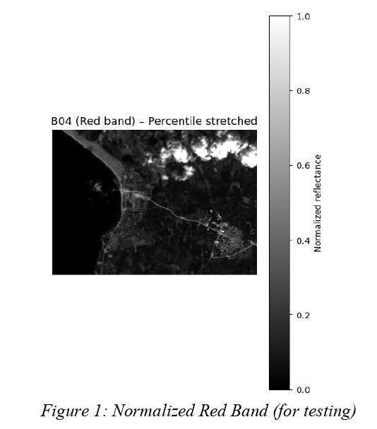
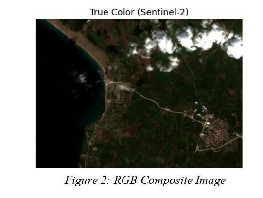

# CENG 462 TERM PROJECT

## Land Cover Detection from Sentinel-2 Images via Image Processing

## Cemanur ADIGÜZEL 

## Umut YILMAZ


## 1- Introduction

Remote sensing data obtained from the Copernicus Sentinel-2 platform are
provided in GeoTIFF format and referenced in the UTM 35N coordinate system. In
this study, raw data acquired from the Sentinel-2 L2A satellite were processed using
classical image processing techniques.
First, spectral indices such as NDVI, NDWI, and NDBI were computed. These
indices were then separated into different classes through a masking approach based
on predefined threshold values. Subsequently, using the affine transformation
methodology and the rasterio library, the real-world width and height of each pixel
were derived. In the final stage, the number of pixels within each mask was used to
calculate the area covered by the corresponding classes.

## 2- Dataset Used

In this study, multispectral raster images belonging to Sentinel-2 Level-2A products
were used. The spectral bands utilized in the analysis are listed below:

 B02 (Blue)
 B03 (Green)
 B04 (Red)
 B08 (Near Infrared – NIR)
 B11 (Short Wave Infrared – SWIR)

All bands were read using the rasterio library and converted to float32 format. For
visualization purposes, percentile-based normalization was applied in order to reduce
the influence of extreme values.


## 3- Preprocessing Steps

## 3.1 Percentile-Based Normalization

```
In satellite imagery, extremely bright or dark pixels can degrade
visualization quality. Therefore, band values were clipped and normalized
within the 2%–98% percentile range. This process was performed to enhance
contrast and improve visual interpretability. As a result, the normalized pixel
values were scaled to the [0,1] range.
```



## 3.2 True Color Image Generation

```
An RGB composite image was generated using the B02, B03, and B
bands. This step was used as a reference to visually assess the correctness of
the classification results.
```



## 4- Calculation of Spectral Indices

Commonly used spectral indices in land cover classification have been
calculated:

```
4.1 NDVI (Normalized Difference Vegetation Index)
The rationale behind using the NDVI formula is based on the fact that
vegetation reflects near-infrared (NIR) radiation at a high rate, while strongly
absorbing light in the red band during the photosynthesis process. As a result
of subtracting the red band and emphasizing the NIR band in the formula, high
NDVI values indicate that the corresponding pixels belong to vegetation-
covered areas.
```

```
4.2 NDWI (Normalized Difference Water Index)
Normalized Difference Water Index (NDWI) is a spectral index used
to distinguish water surfaces from other land cover types in multispectral
satellite imagery. It exploits the characteristic reflectance behavior of water,
which exhibits relatively high reflectance in the green band while strongly
absorbing near-infrared radiation. Consequently, water pixels yield high
positive NDWI values, whereas vegetation and urban surfaces produce low or
negative values. In this study, NDWI is employed as a preprocessing step to
identify water bodies and to separate them from other classes, particularly
clouds and urban areas.
```

```
4.3 NDBI (Normalized Difference Built-up Index)
The rationale behind using the NDBI formula is based on the spectral
behavior of built-up surfaces, which tend to reflect shortwave infrared (SWIR)
radiation more strongly than near-infrared (NIR) radiation. In contrast to
vegetation, urban materials such as concrete, asphalt, and rooftops exhibit
relatively low reflectance in the NIR band while showing higher reflectance in
the SWIR band. By subtracting the NIR band from the SWIR band and
normalizing the result, the NDBI enhances the spectral signature of built-up
areas. Consequently, high NDBI values indicate that the corresponding pixels
are likely associated with urban or built-up land cover.
```

## 5. Rule-Based Land Cover Classification

In this study, the land cover classification was performed using a fully rule-based
approach. For each class, specific spectral conditions and threshold values were
defined based on the physical characteristics of surface materials and their spectral
responses.

```
Figure 3: Rule Based Classified Masks
```
Based on these principles, the following rule-based masks were generated:

```
5.1 Cloud Detection
```
```
Clouds are characterized by high overall brightness and low spectral
differences between visible bands (high whiteness). Therefore, pixels satisfying
the following conditions were classified as clouds:
```
```
Mean brightness of B02, B03, and B04 above the 95th percentile
High whiteness metric
Low NDVI and NDWI values
```

```
5.2 Water Regions
```
```
NDWI > 0.
Pixels outside the cloud mask
```
```
were classified as water bodies.
```
```
5.3 Vegetation Areas
```
```
NDVI > 0.
Pixels excluding water and cloud masks
```
```
were labeled as vegetation-covered areas.
```
```
5.4 Urban Areas
```
```
LowNDVIandNDWIvalues
High reflectance in theSWIR band (B11)
Pixels not belonging to other classes
```
```
were classified as urban or built-up areas.
```
```
This approach relies entirely on classical image processing techniques,
including thresholding, logical operations, and spectral band mathematics.
```
## 6. Area Calculation

In this study, the area of each land cover class was calculated using projected
Sentinel-2 Level-2A raster data provided in GeoTIFF format and referenced in the
WGS84 / UTM 35N coordinate system. The use of a projected coordinate system
ensures that spatial measurements are expressed in meters, allowing for direct and
accurate area computation without additional geodetic transformations.

The Sentinel-2 images were read using the rasterio library, which provides
access not only to the pixel values but also to the spatial metadata embedded in the
GeoTIFF files. This metadata includes the raster’s affine transformation matrix, which
defines the relationship between pixel coordinates and real-world coordinates.

Using the affine transformation parameters obtained from the raster metadata,
the real-world width and height of a single pixel were extracted. The pixel area was
then computed as the absolute product of the pixel width and pixel height, both
expressed in meters. Since the dataset has a uniform spatial resolution, each pixel
represents a fixed ground area.

After generating land cover masks through threshold-based classification of
NDVI, NDWI, and NDBI indices, the number of pixels belonging to each class (water,
vegetation, urban, and cloud) was counted. Pixels corresponding to NoData or invalid


regions were excluded from the analysis using a validity mask to ensure accurate
results.

The total area of each land cover class was calculated by multiplying the
number of valid pixels by the area represented by a single pixel:

```
Areaclass =Npixels × Areapixel
```
```
Pixels Area (m^2 ) Area (ha) Area (km^2 )
Water 140996.0 8.202731e+06 820.273083 8.
Vegetation 349729.0 2.034620e+07 2034.620026 20.
Urban 61779.0 3.594120e+06 359.411975 3.
Cloud 18999.0 1.105306e+06 110.530570 1.
Other 3451.0 2.007690e+05 20.076899 0.
Total Valid 574954.0 3.344913e+07 3344.912553 33.
```
```
Figure 4: Area Calculation Table
```
## 7. Results and Conclusion

The experimental results indicate that the proposed rule-based classification approach,
based on classical image processing techniques, successfully distinguishes vegetation,
water, urban, and cloud regions in Sentinel-2 multispectral imagery. The generated
masks show strong spatial consistency when compared with the true color composite
images, confirming the effectiveness of the selected spectral indices and threshold
values.

Area estimation performed using pixel counts and affine transformation parameters
enabled accurate calculation of real-world land cover areas in the UTM coordinate
system. Overall, the study demonstrates that classical image processing methods
provide an effective and interpretable solution for land cover detection without the use
of machine learning techniques.


